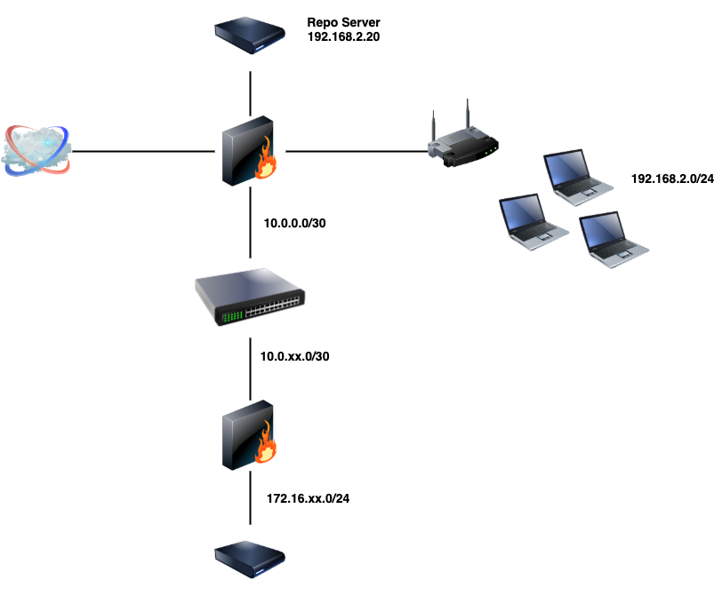

# This is a heading
## heading 2
### heading 3
#### heading 4
##### heading 5
##### heading 6

---

**BOLD**   
__BOLD__

---
*Italic*  
_Italic_

---

***Bold and Italic***  
**_Bold and Italic_**  
__*Bold and Italic*__  
___Bold and Italic___

___
~~strike though~~

---

> This is a quote
---
* -

- bullet
    - sub bullet  
        - sub sub bullet

* bullet
    * sub bullet
        * sub sub bullet

---
1. one
1. two
1. three

---
1. online - [elastic](https://elastic.co)
2. local link - [Readme](../NSM-Engineer-MD/README.md)

---
`systemctl start kibana`

```
suricata.yaml
```
---

| Column1 | Column2 | Column3 | Column4 | 
| --- | --- | --- | --- |
| Data1 | Data2 | Data3 | Data4 |

---

<!-- You can't see this -->

---

# Day 1 Notes
---

## Lab Topology


- Edge router
    - uplink
    - repo server

---
## Suricata Install

1. Install suricata  
`sudo yum install suricata`
2. Edit yaml
```
...

vars:
  # more specific is better for alert accuracy and performance
  address-groups:
    HOME_NET: "[192.168.0.0/16,10.0.0.0/8,172.16.0.0/12]"
    #HOME_NET: "[192.168.0.0/16]"
    #HOME_NET: "[10.0.0.0/8]"
    #HOME_NET: "[172.16.0.0/12]"
    #HOME_NET: "any"
...
